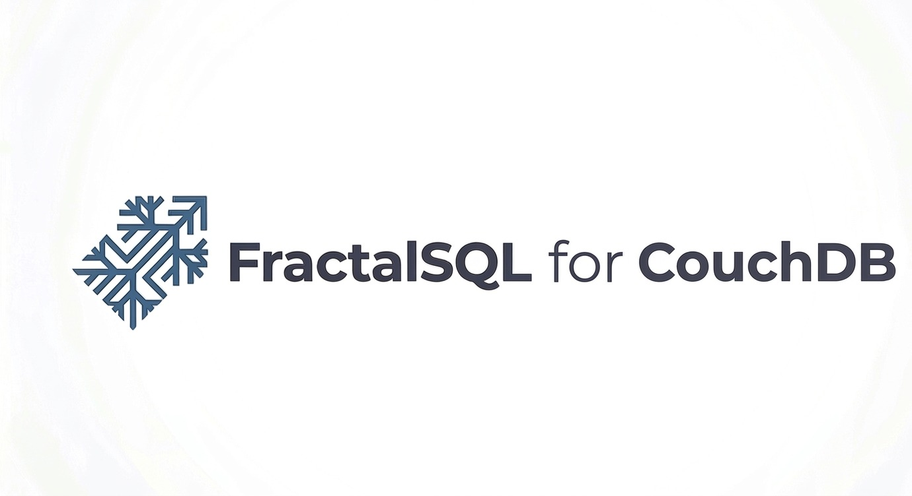

<p align="center">
  
</p>

# FractalSQL for Apache CouchDB — Community Edition

**An external query server that embeds the FractalSQL
Stochastic-Fractal-Search engine directly into CouchDB's map/reduce
pipeline.** Register it under a `language: "fractalsql"` design
document; CouchDB pipes map work through it over JSON-over-stdio and
your Lua map functions get access to the SFS/dFDB optimizer at
document-processing time.

Unlike every other FractalSQL factory, couchdb-fractalsql ships a
**standalone executable**, not a `.so` / `.dll` / `.dylib`. CouchDB's
external-query-server protocol wants a process on the host; our
binary is it.

## Why

- **Vector-aware map functions inside CouchDB.** Embed your search
  logic in the ddoc itself, run it during the document-walk CouchDB
  already does, skip the "extract to external vector DB" step.
- **Static, zero-dependency executable.** LuaJIT and cJSON compiled
  in. `ldd` reports only the glibc kernel shortlist on Linux;
  `otool -L` shows only the system libc + libc++ on macOS.
- **Runs anywhere CouchDB runs.** Native `.deb` / `.rpm` / `.msi` /
  macOS installer `.pkg` per tag. The binary sub-1-MB target carries
  across Linux amd64 / arm64, Windows x64, and macOS Intel + Apple
  Silicon.

## Install

### Linux — `.deb`

```bash
sudo apt install ./fractalsql-couch_1.0.0-1_amd64.deb
# Register with CouchDB:
#   [query_servers]
#   fractalsql = /usr/bin/fractalsql-couch
sudo systemctl restart couchdb
```

Depends on `libc6 (>= 2.36)` and `Recommends: couchdb`. Installs the
binary at `/usr/bin/fractalsql-couch` and docs under
`/usr/share/doc/fractalsql-couch/`.

### Linux — `.rpm`

```bash
sudo rpm -i fractalsql-couch-1.0.0-1.x86_64.rpm
# Register with CouchDB, then:
sudo systemctl restart couchdb
```

Requires `glibc >= 2.36` and `Recommends: couchdb`. Same install
layout as the Debian package.

### macOS — `.pkg`

```bash
# Download from GitHub Releases:
#   FractalSQL-CouchDB-1.0.0-universal.pkg   (universal2 binary)
sudo installer -pkg FractalSQL-CouchDB-1.0.0-universal.pkg -target /
```

Binary lands at `/usr/local/bin/fractalsql-couch`. The `.pkg` is
built as `universal2` so one installer covers both Intel and Apple
Silicon hosts.

### Windows — `.msi`

```powershell
msiexec /i FractalSQL-CouchDB-1.0.0-x64.msi
```

Binary lands at
`C:\Program Files\FractalSQL\CouchDB-Bridge\fractalsql-couch.exe`.

### Register with CouchDB

Add to CouchDB's `local.ini` (path varies by install; typically
`/opt/couchdb/etc/local.ini` on Linux):

```ini
[query_servers]
fractalsql = /usr/bin/fractalsql-couch
```

Restart CouchDB. Design documents then reference the engine via
`"language": "fractalsql"`:

```json
{
  "_id": "_design/example",
  "language": "fractalsql",
  "views": {
    "by_name": {
      "map": "function(doc) if doc.type == 'person' then emit(doc.name, 1) end end"
    }
  }
}
```

See [`packaging/README_COUCH.txt`](packaging/README_COUCH.txt) for the
full install-and-register walkthrough bundled in every release.

## Compatibility matrix

|                    | Linux amd64 | Linux arm64 | macOS Intel | macOS Apple Silicon | Windows x64 |
| ------------------ | :---------: | :---------: | :---------: | :-----------------: | :---------: |
| fractalsql-couch   |     ✓       |      ✓      |     ✓       |         ✓           |     ✓       |

Universal2 macOS `.pkg` covers both macOS arches with one installer.

## How it works

CouchDB's external query-server contract is a single-process, single-
duplex pipe. Each request is one line of JSON; each response is one
line of JSON. The three commands we handle:

| Request | Response |
|---|---|
| `["reset"[, config]]` | `true` |
| `["add_fun", "<lua source>"]` | `true` |
| `["map_doc", {doc}]` | `[[[k, v], …], …]` — one sub-array per registered function |

The process is stateful across commands: `reset` clears the registered
function list; each `add_fun` compiles a Lua chunk and pins it in the
LuaJIT registry; each `map_doc` runs every registered function in
registration order and batches their `emit(k, v)` output into the
response array.

A single LuaJIT state serves the process's lifetime. The SFS core
bytecode is embedded via `include/sfs_core_bc.h` (same source of
truth as every other FractalSQL factory) and its module table is
pinned in the Lua registry so search primitives are available inside
user-written map functions with zero per-call load cost.

## Architecture highlights

- **One Lua state per process.** Map functions compile once; the
  optimizer's FFI arena is allocated once; no per-document GC
  churn. CouchDB spawns query-server processes on demand and
  reuses them across documents, so the one-time compile cost
  amortizes across the entire view-build.
- **cJSON for input/output.** Embedded as a compiled-in source
  copy; no external libcjson runtime dependency.
- **LuaJIT statically linked.** PIC-built from source, folded into
  the executable. No `libluajit-5.1.so` at runtime.

## Tests

The `tests/heartbeat.sh` suite exercises the external query-server
protocol end-to-end against a built binary:

| Case | What it proves |
|---|---|
| 3-emit batching in a single line | One map function, three `emit()` calls, one JSON line out |
| Multi-function positional isolation | Two registered functions with asymmetric emit counts; each lands in its own sub-array |
| Empty sub-array preserves positional slot | Predicate-gated emit that skips still returns `[]` in its slot |

Run with `./tests/heartbeat.sh` after `make`. CI runs it against both
the freshly-built local binary and the installed binary from each
release `.deb` / `.rpm`.

## Building from source

```bash
./build.sh amd64   # docker buildx, zero-dep static binary
./build.sh arm64

# Or for local iteration against system LuaJIT + libcjson:
make
./tests/heartbeat.sh
```

The Dockerfile produces a stripped static binary with LuaJIT +
cJSON folded in. `docker/assert_bin.sh` gates each output on the
`ldd` glibc-shortlist allowlist, size ceiling, and post-link
symbol checks.

## Third-Party Components

- **SFS (Stochastic Fractal Search)** — Hamid Salimi (2014).
  BSD-2-Clause.
- **LuaJIT** — Mike Pall (2005–2023). MIT.
- **cJSON** — Dave Gamble (2009–2017). MIT.

Full attribution in
[`THIRD-PARTY-NOTICES.md`](THIRD-PARTY-NOTICES.md).

## License

MIT. See [`LICENSE`](LICENSE).

---

[github.com/FractalSQLabs](https://github.com/FractalSQLabs) · Issues
and PRs welcome.
